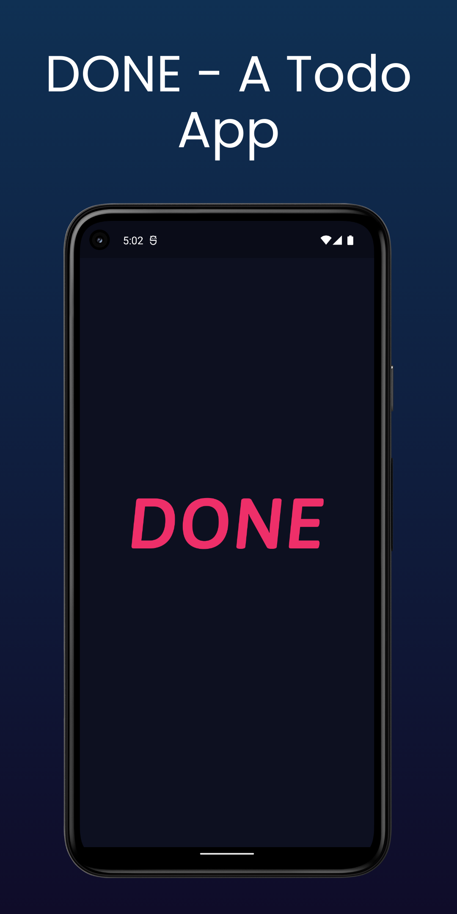
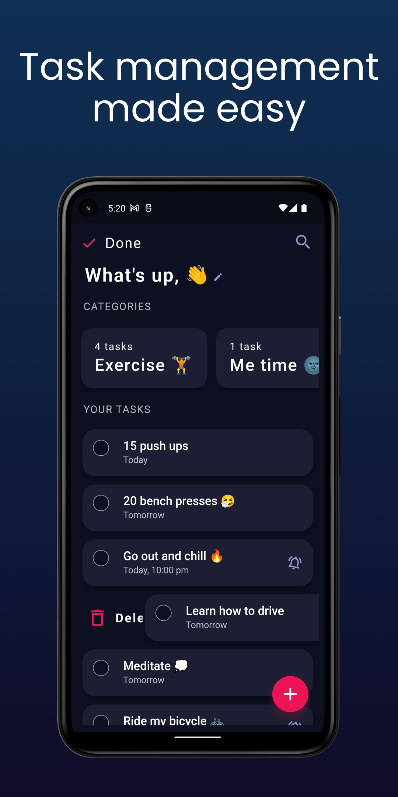
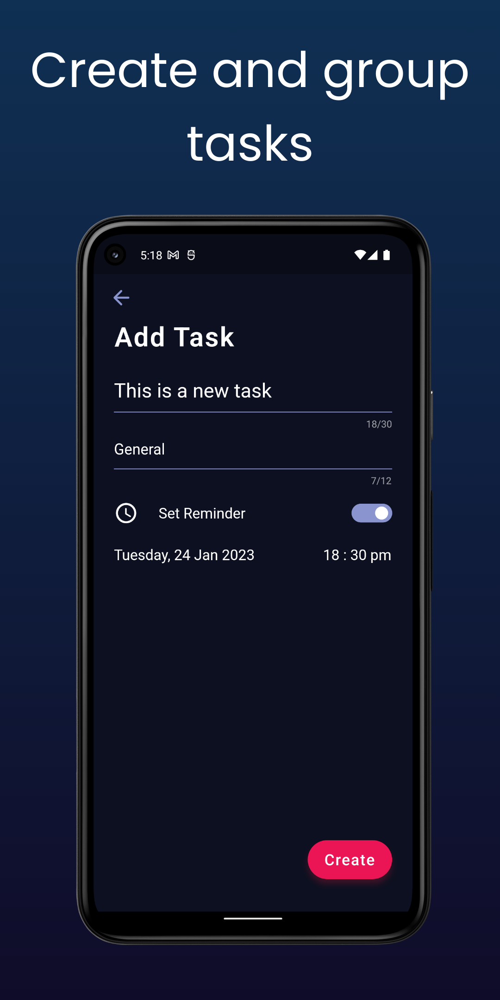
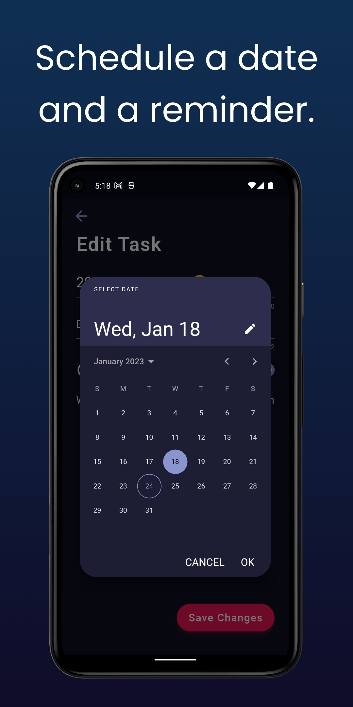
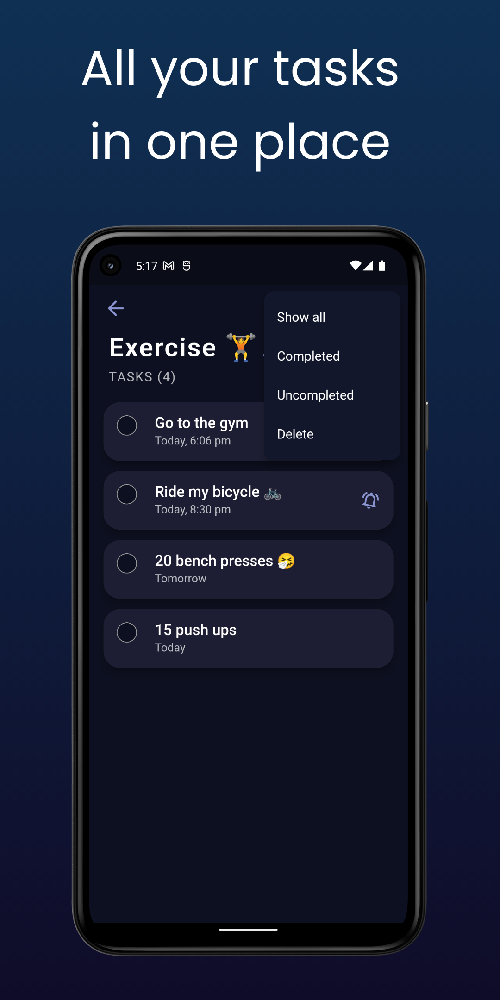
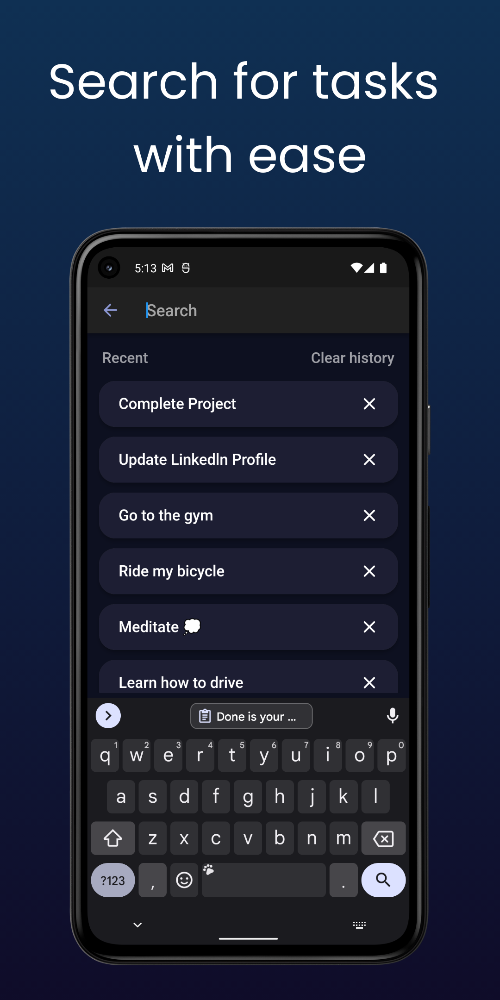

# Done 

Done is an on-the-go To-Do App built using the Flutter framework. It offers a convenient way to manage your tasks and stay organized throughout your day. With a range of features and a responsive user interface, Done v2 ensures a seamless and efficient task management experience.

### Key Features
1. **Sound State Management**:
   - Utilizes the Provider package to manage state in a reactive manner, ensuring smooth and efficient task updates.

2. **Notification Management**:
   - Integrates Flutter Local Notifications to provide timely reminders and keep you informed about upcoming tasks.

3. **Responsive UI**:
   - Implements the Responsive Framework to create a visually appealing and user-friendly interface that adapts to different screen sizes.

4. **Database Management**:
   - Utilizes Sqflite for efficient and reliable storage and management of task data.

5. **Persistent Name Storage**:
   - Stores the user's name using Shared Preferences, allowing for personalized interactions within the app.

6. **Date Formatting and Parsing**:
   - Implements the intl package to handle date formatting and parsing, ensuring accurate representation and manipulation of task dates.

7. **Easy Routing**:
   - Utilizes AutoRoute for simplified and streamlined navigation within the app.

8. **Reactive Approach**:
   - Implements Streams to enable real-time updates and provide an asynchronous flow of data.

### Skills
- **Front-end Development**:
  - Flutter
  - Dart
  - Provider Package
  - AutoRoute
  - Responsive Framework

- **Back-end Development**:
  - Sqflite
  - Shared Preferences
  - Streams

- **Notification Management**:
  - Flutter Local Notifications

- **Date Formatting and Parsing**:
  - intl Package
  
### Getting Started
To get started with Done v2, follow these steps:

1. Download the app for Android devices only: [Download Done](https://drive.google.com/file/d/1C38j1illRYgyiiDv737y3crZ71O57z1k/view?usp=sharing)

### Preview Video
https://user-images.githubusercontent.com/67847070/190135079-e9a733fe-475f-4a91-8887-8d402cab508b.mp4

### Screenshots

<table>
  <tr>
    <td align="center"><strong>Splash Screen</strong></td>
    <td align="center"><strong>Home Screen</strong></td>
    <td align="center"><strong>Add Screen</strong></td>
  </tr>
  <tr>
    <td></td>
    <td></td>
    <td></td>
  </tr>
  <tr>
    <td align="center"><strong>Edit Screen</strong></td>
    <td align="center"><strong>Group Screen</strong></td>
    <td align="center"><strong>Search Screen</strong></td>
  </tr>
  <tr>
    <td></td>
    <td></td>
    <td></td>
  </tr>
</table>

