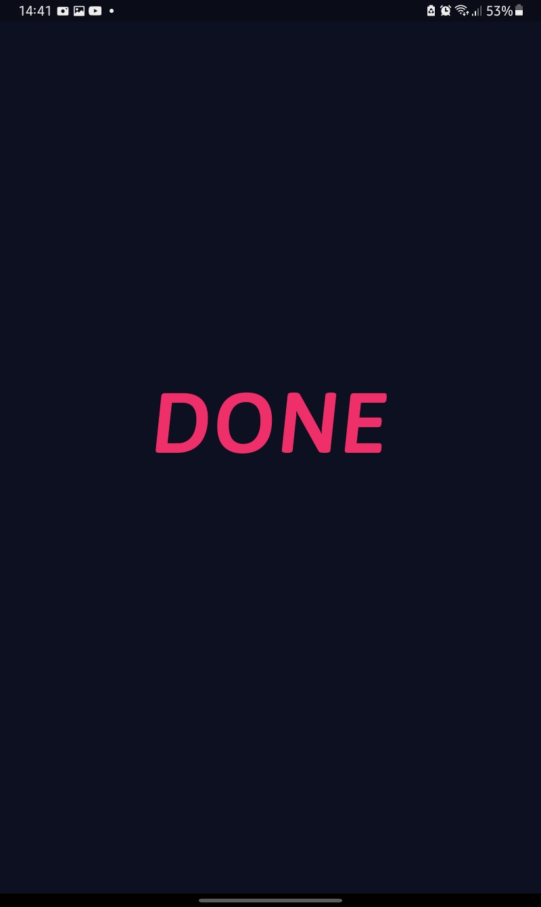
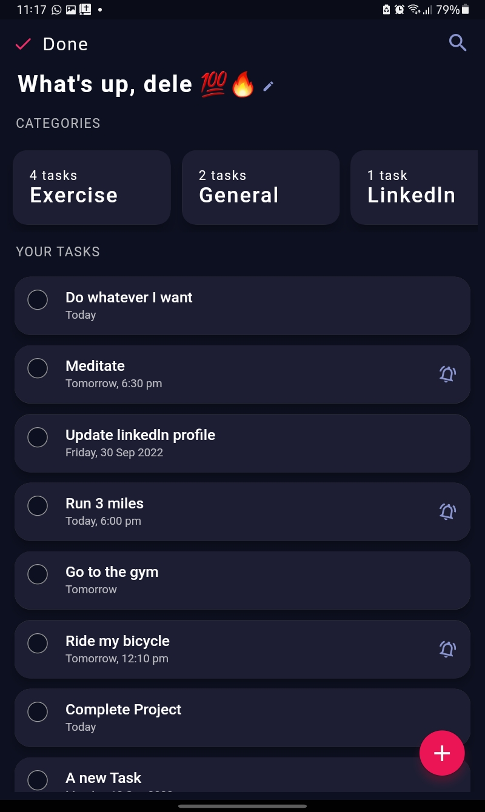
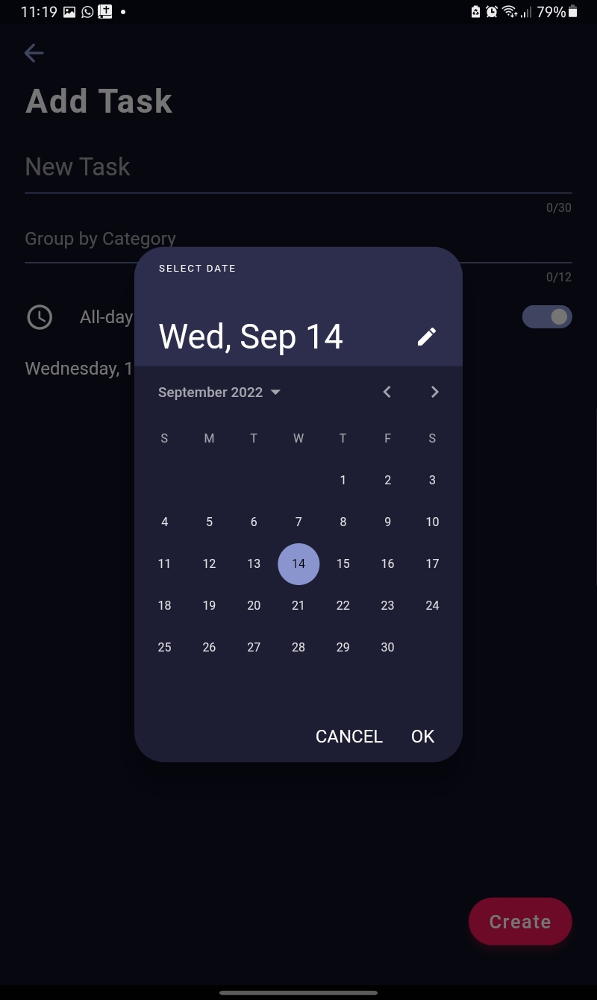
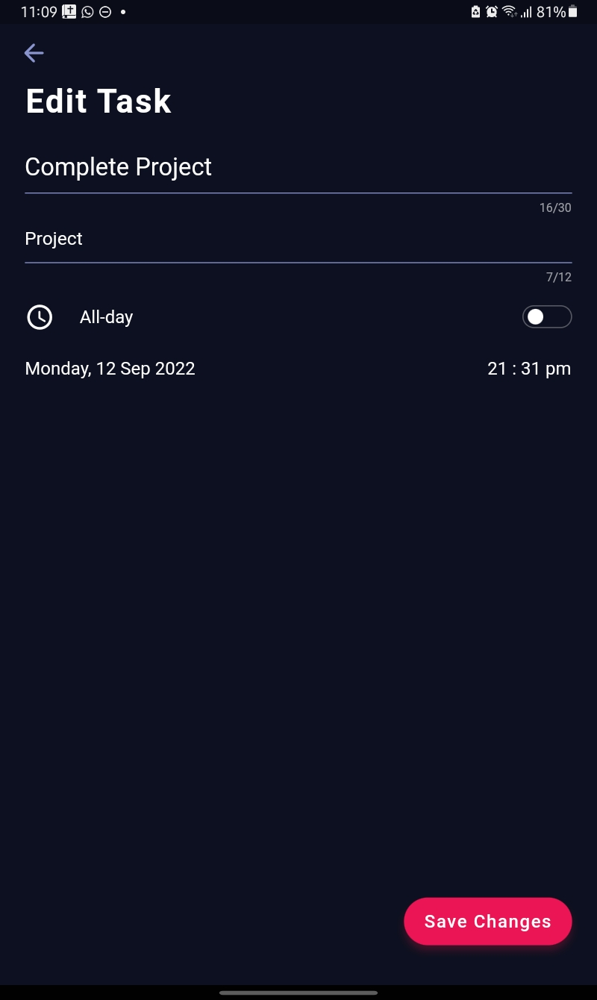
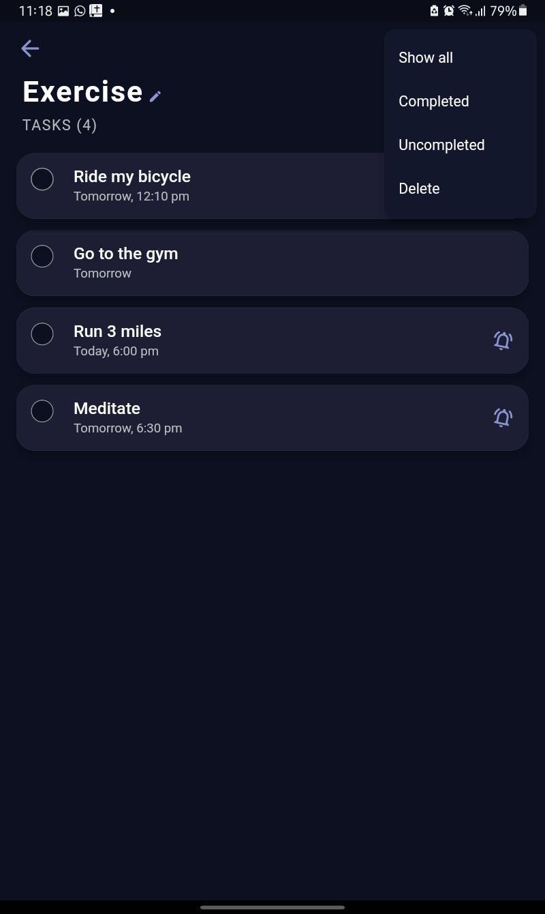

# Done v2 
Your on the go To-Do App made with the [Flutter](https://flutter.dev/) framework. Remake of [Done v1](https://github.com/Bamidele1234/done) to support streams.

## Getting Started 
- Sound State management with [Provider](https://pub.dev/packages/provider)
- Notification management with [Flutter Local Notifications](https://pub.dev/packages/flutter_local_notifications)
- Responsive UI for different screen sizes through [Responsive Framework](https://pub.dev/packages/responsive_framework)
- Database management through [Sqflite](https://pub.dev/packages/sqflite)
- The name text is stored using [Shared Preferences](https://pub.dev/packages/shared_preferences)
- Date formatting and parsing using [intl](https://pub.dev/packages/intl)
- Made reactive via Streams, which provide an asynchronous flow of data.

## Download 🔻
#### For Android Devices only. Get the app [Here](https://drive.google.com/file/d/1E0XJ8VWfbyY5kr8CnAnrUDHJ3yxzVXvQ/view?usp=drivesdk). 
#### This app needs to have notifications enabled as a permission

## Preview
https://user-images.githubusercontent.com/67847070/190135079-e9a733fe-475f-4a91-8887-8d402cab508b.mp4

## Screenshots
### Splash Screen

### Home Screen

### Add Screen

### Edit Screen

### Group Screen

**Other dependencies used**
--
[Animated Text Kit](https://pub.dev/packages/animated_text_kit), [Path Provider](https://pub.dev/packages/path_provider), [Rounded Check Box](https://pub.dev/packages/roundcheckbox), [Time Zone](https://pub.dev/packages/timezone), etc

**Extras 💫**
--
Feel free to contribute and report bugs

